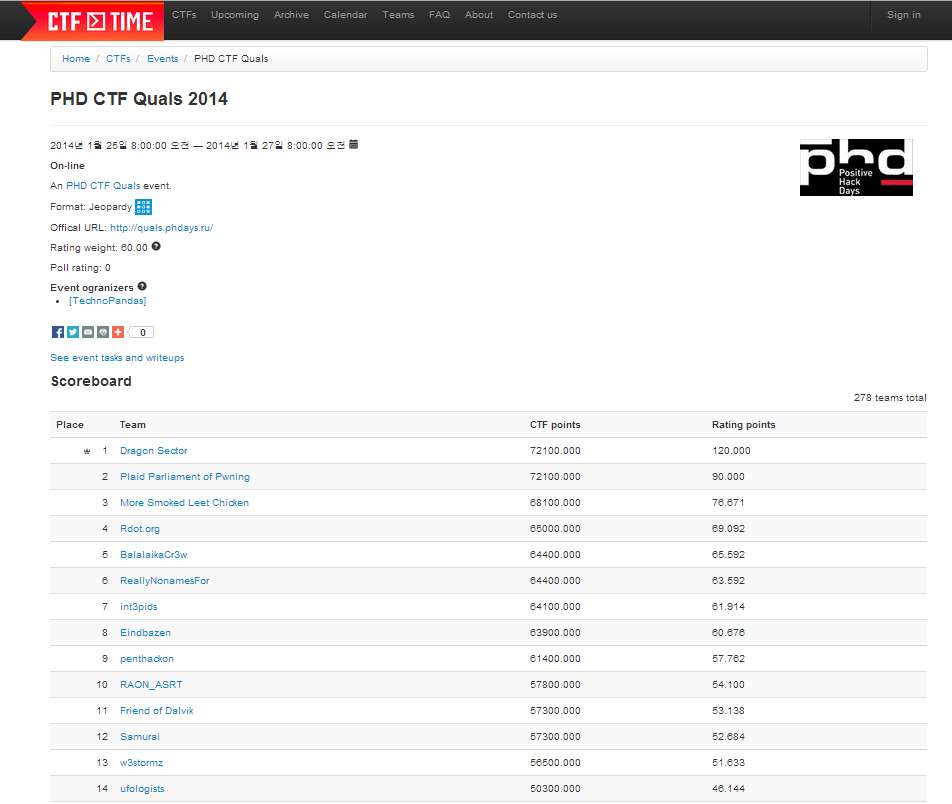

Participated as `Friend of Dalvik` (a part of wowhacker team


## Snowden Gadget

By bruteforce of characters to the server, you find out that the that there is "AT" command on the shell.
Additionally, the hint was given as "Hayes".
By googling the hint, you find out that the challenge is related to the Huawei modem.

```
4.15 Message list command +CMGL 
4.15.1 Command Syntax 
Command Possible response(s) 
+CMGL[=<stat>] 
In case of pdu mode and successful execution of command: 
[<CR><LF>+CMGL: 
<index>,<stat>,[<reserved>],<length><CR><LF><pdu> 
[<CR><LF>+CMGL:<index>,<stat>,[<reserved>],<length><CR
><LF><pdu> 
[...]]<CR><LF>]<CR><LF>OK<CR><LF> 
Otherwise: 
<CR><LF>+CMS ERROR: <err><CR><LF> 
+CMGL=? <CR><LF>+CMGL: (list of supported <stat>s) 
<CR><LF><CR><LF>OK<CR><LF
```

```
8.5 Phonebook reading ^CPBR 
8.5.1 Command Syntax 
Command Possible response(s) 
^CPBR=<index1> 
[,<index2>] 
[<CR><LF>^CPBR: 
<index1>,<number>,<type>,<text>,<coding>[,<email>][[...] 
<CR><LF>^CPBR: 
<index2>,<number>,<type>,<text>],<coding>[,<email>]]<CR>
<LF>]<CR><LF>OK<CR><LF> 
In case of MS-related error: 
<CR><LF>+CME ERROR: <err><CR><LF> 
^CPBR=? 
<CR><LF>^CPBR: (list of supported 
<index>s),[<nlength>],[<tlength>],[<mlenth>]<CR><LF><CR>
<LF>OK<CR><LF> 
In case of MS-related error: 
<CR><LF>+CME ERROR: <err><CR><LF> 
8.5.2 Description 
This command returns the phonebook entries between positions index1 and index2 in 
the currently selected phonebook memory. If no entry exists between index1 and 
index2, the following will be returned: 
+CME ERROR: not found 
Alternatively, you can input index1 only, and only the phonebook entries in the position 
index1 will be returned. 
The TEST command returns the position range of the currently selected p
````

By using the +CMGL and ^CPBR command, you will eventually get the flag.